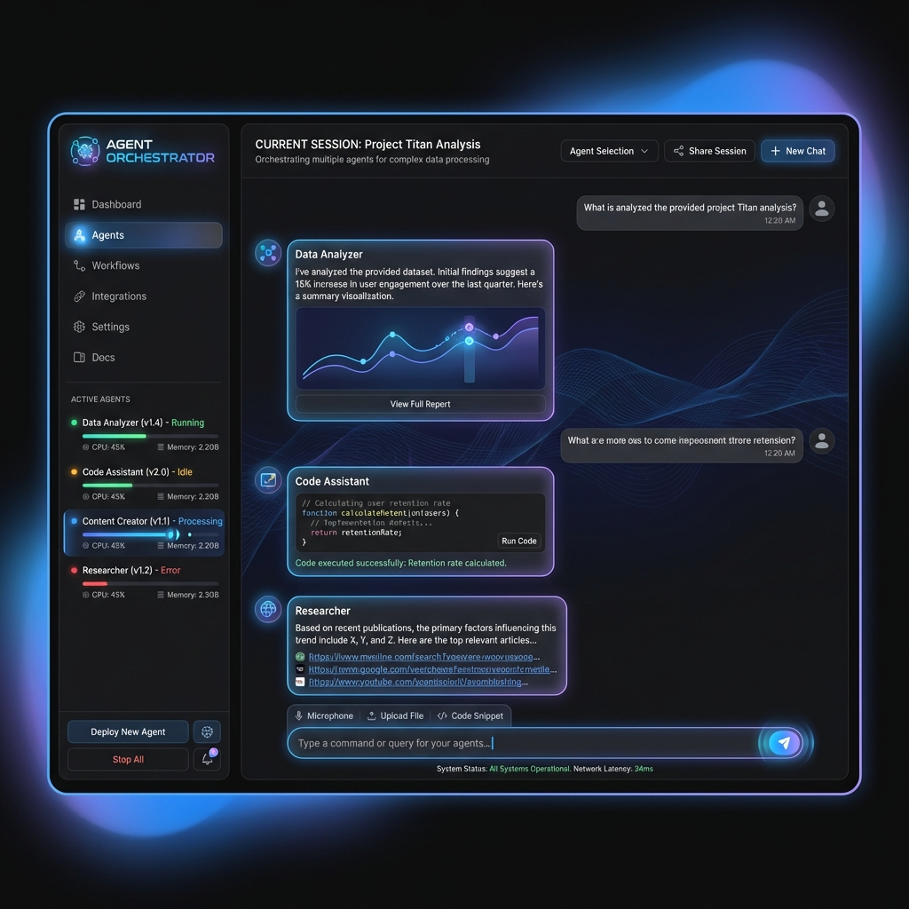

# 🤖 Agent Orchestrator с Gemini API & Web UI

Мощный оркестратор AI-агентов, использующий Google Gemini API для выполнения сложных задач через координацию специализированных агентов. Теперь с современным веб-интерфейсом в стиле Gemini!

## 🌟 Новое: Современный Web UI
Теперь вы можете управлять своей командой агентов через браузер. Интерфейс выполнен в глубокой темной теме с использованием лучших практик дизайна Gemini.

- 🎨 **Gemini 3 Style**: Эстетичный темный интерфейс с плавными анимациями.
- ⚡ **Floating Chat Input**: Парящее поле ввода для максимального удобства.
- 📂 **File context**: Загрузка файлов напрямую через браузер.
- 📊 **Real-time Logs**: Наблюдайте за "мыслями" координатора в реальном времени.



## ✨ Возможности

- 🤖 **Множественные специализированные агенты** - исследователь, аналитик, писатель и координатор.
- 🌍 **Веб-поиск** - Researcher умеет искать актуальную информацию в интернете.
- 🔄 **Умная оркестрация** - автоматическое планирование и координация сложных задач.
- 💻 **Два режима работы** - современный Web UI и мощный CLI.
- 📝 **Контекстная передача** - агенты обмениваются данными для достижения цели.
- 🔧 **Легко расширяемый** - добавление нового агента занимает пару минут.

## 🚀 Быстрый старт

### 1. Установка и запуск (Web UI)

```bash
# Клонировать проект
git clone git@github.com:sadSapiens/AgentOrchestrator.git
cd AgentOrchestrator

# Настройте API ключ в .env (см. ниже)

# Запустите Веб-интерфейс
./venv/bin/streamlit run app.py
```

### 2. Настройка API ключа

```bash
cp .env.example .env
# Добавьте ваш GEMINI_API_KEY в .env
# Получить ключ: https://makersuite.google.com/app/apikey
```

## 🎭 Агенты

| Агент | Роль | Специализация |
|-------|------|---------------|
| 🔍 **Researcher** | Исследователь | Сбор информации в сети, поиск в Google/DDG |
| 📊 **Analyzer** | Аналитик | Глубокий анализ данных и выявление трендов |
| ✍️ **Writer** | Писатель | Создание структурированных статей и отчетов |
| 🎯 **Coordinator** | Координатор | Построение стратегии и управление командой |

## 💡 Способы использования

### 1. Веб-приложение (Streamlit)
Самый удобный способ. Запустите `streamlit run app.py` и откройте `localhost:8501`.

### 2. Интерактивный CLI
Запустите `./run.sh` для доступа к интерактивной консоли. Там можно выполнять команды типа `orchestrate "Создай отчет"`.

### 3. Командная строка
```bash
python main.py --orchestrate --task "Проведи аудит безопасности этого проекта"
```

## 📚 Документация

| Документ | Описание |
|----------|----------|
| [📖 QUICKSTART.md](QUICKSTART.md) | Руководство по быстрому старту |
| [🎓 TUTORIAL.md](TUTORIAL.md) | Пошаговый туториал с примерами |
| [🏗️ ARCHITECTURE.md](ARCHITECTURE.md) | Описание архитектуры |
| [📋 SUMMARY.md](SUMMARY.md) | Краткая сводка всех возможностей v1.2 |

## ⚙️ Конфигурация (.env)

```env
GEMINI_API_KEY=your-api-key
MODEL_NAME=gemini-2.0-flash-exp
TEMPERATURE=0.7
LOG_LEVEL=INFO
```

---

**Создано с ❤️ используя Google Gemini API**
