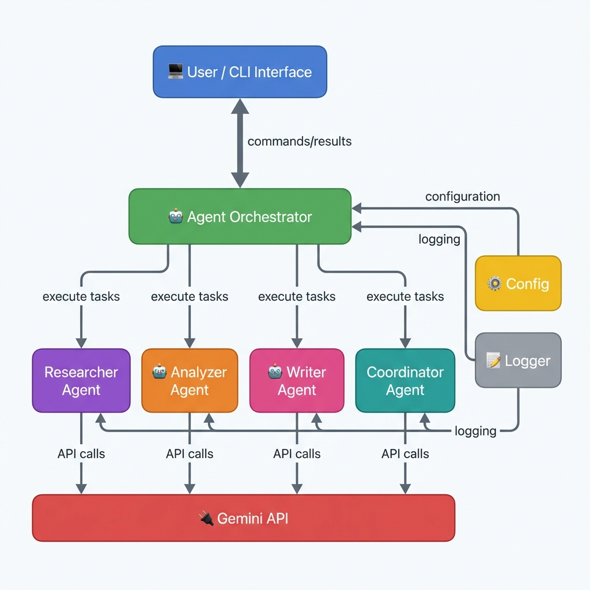

# 🤖 Agent Orchestrator с Gemini API

Мощный оркестратор AI-агентов, использующий Google Gemini API для выполнения сложных задач через координацию специализированных агентов.



## ✨ Возможности

- 🤖 **Множественные специализированные агенты** - каждый агент имеет свою роль и экспертизу
- 🔄 **Умная оркестрация** - автоматическое планирование и координация задач
- 💬 **Интерактивный CLI** - удобный интерфейс командной строки
- 📝 **Полное логирование** - отслеживание всех действий и результатов
- 🎯 **Контекстная передача данных** - агенты обмениваются информацией
- ⚡ **Асинхронное выполнение** - быстрая обработка задач
- 🔧 **Легко расширяемый** - простое добавление новых агентов

## 🎭 Агенты

| Агент | Роль | Специализация |
|-------|------|---------------|
| 🔍 **Researcher** | Исследователь | Сбор и структурирование информации |
| 📊 **Analyzer** | Аналитик | Анализ данных и выявление инсайтов |
| ✍️ **Writer** | Писатель | Создание структурированного контента |
| 🎯 **Coordinator** | Координатор | Планирование и управление задачами |

## 🚀 Быстрый старт

### 1. Установка

```bash
# Клонировать или скачать проект
cd AgentOrchestrator

# Запустить скрипт быстрого старта
./run.sh
```

Скрипт автоматически:
- ✅ Создаст виртуальное окружение
- ✅ Установит зависимости
- ✅ Проверит конфигурацию
- ✅ Запустит интерактивный режим

### 2. Настройка API ключа

```bash
# Создать .env файл
cp .env.example .env

# Добавить ваш API ключ
# Получить ключ: https://makersuite.google.com/app/apikey
nano .env
```

### 3. Первый запуск

```bash
# Интерактивный режим
./run.sh

# Или напрямую через Python
python main.py --interactive
```

## 💡 Примеры использования

### Интерактивный режим

```bash
> list                                    # Показать агентов
> task researcher Исследовать AI          # Одиночная задача
> orchestrate Создать отчет о блокчейне   # Оркестрация
> history researcher                      # История агента
> help                                    # Справка
```

### Командная строка

```bash
# Список агентов
python main.py --list

# Исследование темы
python main.py --agent researcher --task "Исследовать квантовые компьютеры"

# Анализ данных
python main.py --agent analyzer --task "Проанализировать тренды в AI"

# Создание контента
python main.py --agent writer --task "Написать статью о машинном обучении"

# Оркестрация (несколько агентов)
python main.py --orchestrate --task "Создать полный отчет о блокчейн технологиях"
```

### Программное использование

```python
import asyncio
from orchestrator import AgentOrchestrator

async def main():
    orchestrator = AgentOrchestrator()
    
    # Одиночная задача
    result = await orchestrator.execute_single_task(
        "researcher",
        "Исследовать квантовые компьютеры"
    )
    
    # Оркестрация
    results = await orchestrator.orchestrate_task(
        "Создать отчет о блокчейне"
    )
    
    print(results['final_result'])

asyncio.run(main())
```

## 📚 Документация

| Документ | Описание |
|----------|----------|
| [📖 QUICKSTART.md](QUICKSTART.md) | Руководство по быстрому старту |
| [🎓 TUTORIAL.md](TUTORIAL.md) | Пошаговый туториал с примерами |
| [💻 CLI_GUIDE.md](CLI_GUIDE.md) | Полное руководство по CLI |
| [🏗️ ARCHITECTURE.md](ARCHITECTURE.md) | Архитектура системы |
| [📁 PROJECT_STRUCTURE.md](PROJECT_STRUCTURE.md) | Структура проекта |

## 🛠️ Структура проекта

```
AgentOrchestrator/
├── 📄 main.py                 # CLI интерфейс
├── 🎯 orchestrator.py         # Главный оркестратор
├── 🚀 run.sh                  # Скрипт быстрого запуска
├── 📝 examples.py             # Примеры использования
│
├── 🤖 agents/                 # Пакет агентов
│   ├── base_agent.py         # Базовый класс
│   ├── researcher.py         # Исследователь
│   ├── analyzer.py           # Аналитик
│   ├── writer.py             # Писатель
│   └── coordinator.py        # Координатор
│
├── 🔧 utils/                  # Утилиты
│   ├── config.py             # Конфигурация
│   └── logger.py             # Логирование
│
└── 📚 docs/                   # Документация
    ├── README.md
    ├── QUICKSTART.md
    ├── TUTORIAL.md
    ├── CLI_GUIDE.md
    ├── ARCHITECTURE.md
    └── PROJECT_STRUCTURE.md
```

## ⚙️ Конфигурация

Создайте файл `.env`:

```env
# API настройки
GEMINI_API_KEY=your-api-key-here
MODEL_NAME=gemini-2.0-flash-exp
TEMPERATURE=0.7
MAX_TOKENS=2048

# Логирование
LOG_LEVEL=INFO
LOG_FILE=orchestrator.log
```

## 🎯 Сценарии использования

### 📊 Исследование рынка
```bash
python main.py --orchestrate --task "Провести исследование рынка электромобилей"
```

### 📝 Создание контента
```bash
python main.py --agent writer --task "Написать статью о преимуществах AI в медицине"
```

### 🔍 Анализ данных
```bash
python main.py --agent analyzer --task "Проанализировать тренды удаленной работы"
```

### 📋 Планирование проекта
```bash
python main.py --agent coordinator --task "Создать план разработки мобильного приложения"
```

## 🔧 Расширение системы

### Добавление нового агента

```python
# agents/my_agent.py
from agents.base_agent import BaseAgent

class MyAgent(BaseAgent):
    def __init__(self):
        super().__init__(
            name="MyAgent",
            role="Моя роль",
            system_prompt="Инструкции для агента"
        )
    
    def get_capabilities(self):
        return {
            "capability": "Описание возможности"
        }
```

Подробнее см. [ARCHITECTURE.md](ARCHITECTURE.md#расширение-системы)

## 📊 Логирование

Все действия логируются в `orchestrator.log`:

```bash
# Просмотр в реальном времени
tail -f orchestrator.log

# Поиск ошибок
grep ERROR orchestrator.log
```

## 🤝 Вклад в проект

Приветствуются:
- 🐛 Отчеты об ошибках
- 💡 Предложения новых функций
- 🔧 Pull requests
- 📖 Улучшения документации

## 📝 Лицензия

MIT License

## 🔗 Полезные ссылки

- [Google AI Studio](https://makersuite.google.com/app/apikey) - Получить API ключ
- [Gemini API Docs](https://ai.google.dev/docs) - Документация Gemini API
- [Python Docs](https://docs.python.org/3/) - Документация Python

## 🆘 Поддержка

Если у вас возникли проблемы:

1. Проверьте [QUICKSTART.md](QUICKSTART.md#решение-проблем)
2. Просмотрите [TUTORIAL.md](TUTORIAL.md#урок-9-отладка-и-решение-проблем)
3. Изучите логи в `orchestrator.log`
4. Проверьте конфигурацию в `.env`

## 🎉 Начало работы

```bash
# 1. Настройте API ключ
cp .env.example .env
# Отредактируйте .env

# 2. Запустите
./run.sh

# 3. Попробуйте
> list
> task researcher Исследовать AI агентов
> orchestrate Создать отчет о блокчейне

# 4. Изучите документацию
# См. TUTORIAL.md для пошагового обучения
```

---

**Создано с ❤️ используя Google Gemini API**
